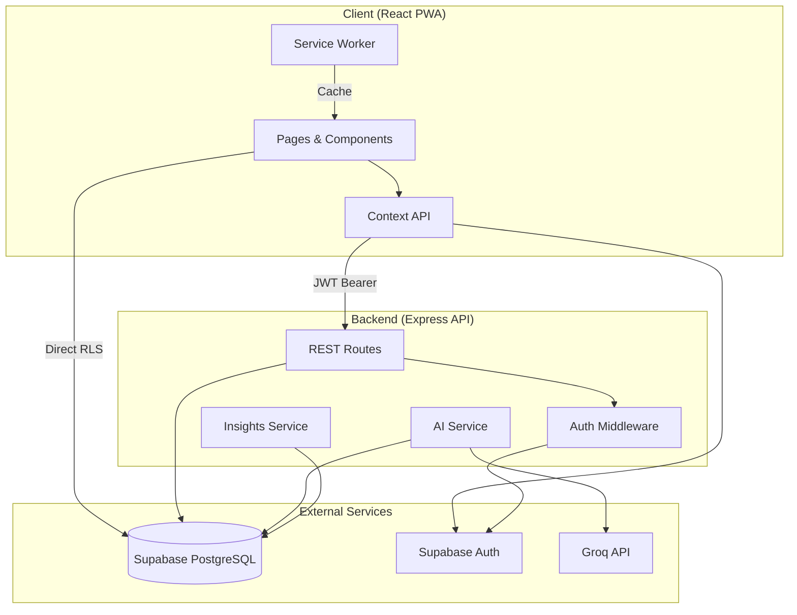
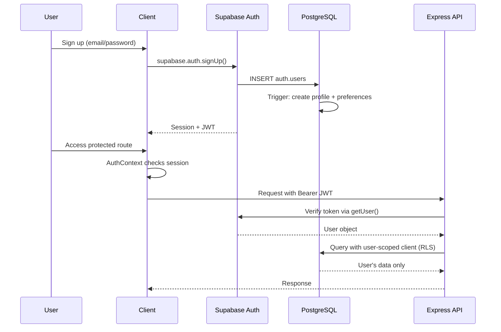
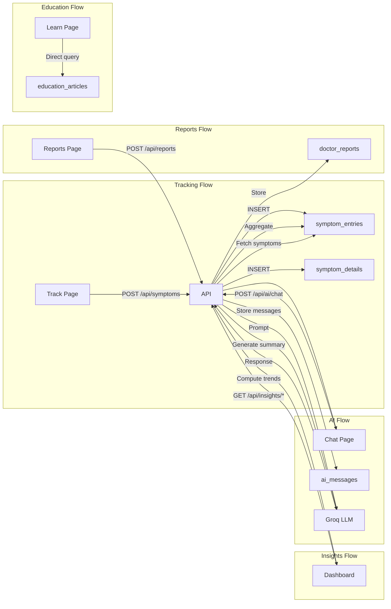

# Cyra Architecture

## System Overview

Cyra is a full-stack women's health companion built as a monorepo with a React SPA frontend, Express API backend, Supabase for auth/database, and Groq for AI features.



## Folder Structure

```
cyra/
├── client/                          # React 18 + Vite frontend
│   ├── public/                      # Static assets, PWA icons
│   ├── src/
│   │   ├── components/
│   │   │   ├── auth/                # ProtectedRoute
│   │   │   ├── charts/              # Recharts visualizations
│   │   │   ├── layout/              # AppLayout, navigation
│   │   │   └── ui/                  # Design system primitives
│   │   ├── contexts/                # Auth, Theme, Symptom state
│   │   ├── lib/                     # API client, Supabase, constants
│   │   ├── pages/                   # Route-level page components
│   │   ├── types/                   # TypeScript interfaces
│   │   ├── App.tsx                  # Route definitions
│   │   ├── main.tsx                 # Entry point + providers
│   │   └── index.css                # Tailwind + global styles
│   ├── index.html
│   ├── vite.config.ts               # Vite + PWA plugin
│   └── tailwind.config.js           # Design tokens
│
├── server/                          # Express API backend
│   └── src/
│       ├── config/                  # Supabase, Groq clients
│       ├── controllers/             # Request handlers
│       ├── middleware/              # Auth, rate limiting, errors
│       ├── routes/                  # Route definitions
│       ├── services/                # Business logic
│       ├── types/                   # Database types
│       └── index.ts                 # Server entry
│
├── supabase/
│   └── migrations/                  # SQL schema + RLS + seeds
│
└── docs/                            # Architecture documentation
```

## State Management Architecture

Cyra uses React Context API with three focused providers:

```mermaid
graph TD
    TP[ThemeProvider] --> AP[AuthProvider]
    AP --> SP[SymptomProvider]
    SP --> APP[App Routes]

    AP -->|user, session, profile| Pages
    AP -->|JWT token| API Client
    TP -->|theme, resolvedTheme| UI Components
    SP -->|entries, trends, summary| Dashboard/Track/Insights
```

| Context | Responsibility | Persistence |
|---------|---------------|-------------|
| `AuthContext` | User session, profile, sign in/out | Supabase Auth (localStorage) |
| `ThemeContext` | Light/dark/system theme | Supabase `user_preferences` |
| `SymptomContext` | Symptom data, insights cache | API fetch + in-memory |

**Design decisions:**
- No Redux — app state is moderate in complexity; Context avoids boilerplate
- Server state fetched on mount, cached in context (not React Query) for simplicity
- Theme synced to database for cross-device consistency

## Authentication Flow



**Key security properties:**
- JWT never stored manually — Supabase client handles refresh
- API validates every request server-side (no client-only auth)
- Database RLS enforces row-level isolation as defense-in-depth
- Service role key used only server-side, never exposed to client

## Data Flow



**Read path optimization:**
- Education articles read directly from Supabase (public RLS policy)
- Symptom/insight data routed through API for aggregation logic
- PWA service worker caches API responses for offline access

## Deployment Architecture

```
┌─────────────┐     ┌──────────────┐     ┌─────────────┐
│   Vercel/   │     │   Railway/   │     │  Supabase   │
│   Netlify   │────▶│   Render     │────▶│   Cloud     │
│  (Client)   │     │  (API)       │     │  (DB+Auth)  │
└─────────────┘     └──────────────┘     └─────────────┘
                           │
                    ┌──────┴──────┐
                    │  Groq API   │
                    └─────────────┘
```

## Technology Decisions

| Decision | Rationale |
|----------|-----------|
| Monorepo (npm workspaces) | Shared types, single deploy pipeline |
| Supabase over custom auth | Production auth + RLS in days, not months |
| Groq over OpenAI | Fast inference, cost-effective for health chat |
| Context over Redux | Appropriate complexity, faster iteration |
| Vite PWA plugin | Zero-config service worker + manifest |
| TailwindCSS | Consistent design system, mobile-first utilities |
