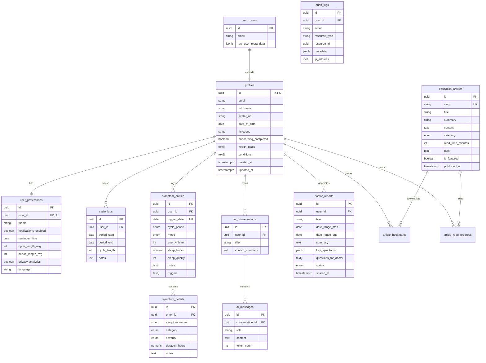

# Database Schema

## Entity Relationship Diagram



## Enums

| Enum | Values |
|------|--------|
| `symptom_category` | physical, emotional, cognitive, sleep, digestive, skin, energy |
| `severity_level` | none, mild, moderate, severe |
| `cycle_phase` | menstrual, follicular, ovulation, luteal, unknown |
| `mood_type` | calm, anxious, irritable, sad, energetic, foggy, neutral |
| `article_category` | pmos_basics, symptom_management, nutrition, mental_health, doctor_prep, lifestyle, research |
| `report_status` | draft, ready, shared |

## Indexes

| Table | Index | Purpose |
|-------|-------|---------|
| `cycle_logs` | `(user_id, period_start DESC)` | Recent cycles lookup |
| `symptom_entries` | `(user_id, logged_date DESC)` | Daily entries + date range queries |
| `symptom_details` | `(entry_id)` | Join performance |
| `ai_conversations` | `(user_id, updated_at DESC)` | Recent conversations |
| `ai_messages` | `(conversation_id, created_at)` | Message history |
| `doctor_reports` | `(user_id, created_at DESC)` | Report listing |
| `audit_logs` | `(user_id, created_at DESC)` | Audit trail |

## Row Level Security

All user-owned tables enforce `auth.uid() = user_id` policies. Education articles have a public read policy. Audit logs allow insert/select on own records only.

## Triggers

| Trigger | Event | Action |
|---------|-------|--------|
| `on_auth_user_created` | INSERT on `auth.users` | Creates profile + default preferences |
| `*_updated_at` | UPDATE on all mutable tables | Sets `updated_at = NOW()` |

## Migrations

```
supabase/migrations/
├── 001_initial_schema.sql    # Tables, enums, RLS, triggers
└── 002_seed_education.sql    # Sample education articles
```

Run with: `supabase db push` or apply via Supabase dashboard SQL editor.
