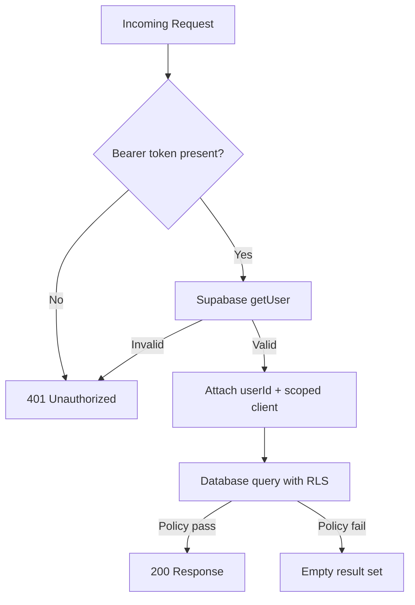

# Security Architecture

## Threat Model

Cyra handles sensitive health data. The security model addresses:

| Threat | Mitigation |
|--------|-----------|
| Unauthorized data access | JWT auth + RLS on every table |
| Token theft (XSS) | HttpOnly not applicable (SPA); CSP via Helmet, input sanitization |
| API abuse | Rate limiting (general + AI-specific) |
| Data leakage between users | Row Level Security enforced at database level |
| Service role key exposure | Server-only; never in client bundle |
| AI prompt injection | System prompt constraints; no medical diagnosis |
| Man-in-the-middle | HTTPS enforced in production |
| Offline data exposure | Service worker caches only non-sensitive API responses |

## Authentication & Authorization



**Defense in depth:**
1. **Route middleware** — Express `authenticate()` rejects unauthenticated requests
2. **User-scoped Supabase client** — API creates a client with the user's JWT, not service role
3. **Row Level Security** — PostgreSQL policies enforce `auth.uid() = user_id` even if application code has bugs

## Data Classification

| Data Type | Classification | Storage | Access |
|-----------|---------------|---------|--------|
| Email, profile | PII | Supabase (encrypted at rest) | Owner only (RLS) |
| Symptom entries | PHI-adjacent | Supabase (encrypted at rest) | Owner only (RLS) |
| AI conversations | Sensitive | Supabase (encrypted at rest) | Owner only (RLS) |
| Doctor reports | PHI-adjacent | Supabase (encrypted at rest) | Owner only (RLS) |
| Education articles | Public | Supabase | Public read (RLS) |
| JWT tokens | Credential | Client localStorage (Supabase SDK) | Client-side only |

## API Security

### Middleware Stack

```
Request → Helmet (security headers)
       → CORS (origin whitelist)
       → Rate Limiter
       → Auth Middleware (JWT verification)
       → Input Validation (Zod schemas)
       → Controller
       → Error Handler (no stack traces in production)
```

### Rate Limits

| Endpoint Group | Limit | Window |
|---------------|-------|--------|
| AI endpoints | 30 requests | 15 minutes |
| General API | 200 requests | 15 minutes |

### Input Validation

All POST/PATCH endpoints validate request bodies with Zod schemas:
- String length limits (messages max 4000 chars, notes max 2000)
- Enum validation for severity, mood, cycle phase
- UUID validation for resource IDs

## AI Safety

The Groq integration includes safety guardrails:

1. **System prompt** explicitly prohibits medical diagnosis and treatment advice
2. **Crisis detection guidance** — prompts model to urge professional help for severe symptoms
3. **Educational framing** — all responses positioned as educational support
4. **Conversation logging** — full audit trail in `ai_messages` table
5. **Rate limiting** — prevents abuse and cost overruns

## Client Security

- Environment variables prefixed with `VITE_` expose only public keys (Supabase anon key)
- Service role key and Groq API key are server-only
- PWA service worker caches API responses with 24-hour expiration
- No health data stored in localStorage beyond Supabase session tokens

## HIPAA Considerations

Cyra is architected with healthcare privacy principles but is **not HIPAA-certified** out of the box. For production healthcare deployment:

- [ ] Execute BAA with Supabase (Enterprise plan)
- [ ] Enable Supabase audit logging
- [ ] Implement data export/deletion (GDPR/CCPA)
- [ ] Add encryption for data at rest verification
- [ ] Conduct penetration testing
- [ ] Implement session timeout policies
- [ ] Add MFA support via Supabase Auth

## Audit Trail

The `audit_logs` table captures:
- User actions (login, data export, report sharing)
- Resource type and ID
- IP address and timestamp
- Optional metadata JSON

RLS ensures users can only view their own audit logs.

## Environment Variables

| Variable | Location | Sensitivity |
|----------|----------|-------------|
| `SUPABASE_URL` | Server + Client | Public |
| `SUPABASE_ANON_KEY` | Server + Client | Public (RLS-protected) |
| `SUPABASE_SERVICE_ROLE_KEY` | Server only | **Secret** |
| `GROQ_API_KEY` | Server only | **Secret** |
| `JWT_SECRET` | Server only | **Secret** |

Never commit `.env` files. Use `.env.example` as template.
